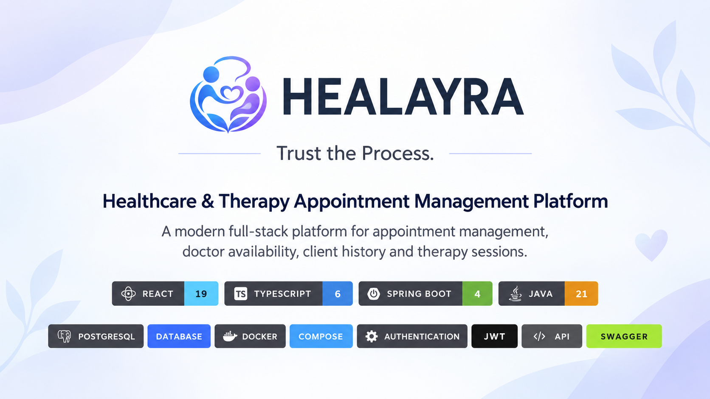

<div align="center">



<br><br>

<h1>Healayra</h1>

<h3>Healthcare & Therapy Appointment Management Platform</h3>

<p><strong>Trust the Process.</strong></p>

<br>

<a href="#about-healayra">✨ About</a> •
<a href="#repositories">📦 Repositories</a> •
<a href="#architecture">🏗️ Architecture</a> •
<a href="#tech-stack">🚀 Tech Stack</a> •
<a href="#features">✅ Features</a>

<br>

<a href="#appointment-workflow">📅 Workflow</a> •
<a href="#security">🔐 Security</a> •
<a href="#database">🗄️ Database</a> •
<a href="#running-healayra">▶️ Run</a> •
<a href="#testing">🧪 Testing</a>

<br><br>

</div>

---

<a id="about-healayra"></a>

# ✨ About Healayra

**Healayra** is a full-stack healthcare and therapy appointment management platform developed as the final project for the **Coding Factory** program.

The application supports the interaction between healthcare professionals and their clients / θεραπευόμενους through a complete appointment-management workflow.

The current MVP includes:

- Client registration and authentication
- Doctor authentication
- Doctor availability management
- Appointment booking
- Session / service selection
- Appointment confirmation
- Appointment status management
- Client management
- Client search
- Visit / session history
- Notes attached to visits
- Role-based authorization
- Doctor ownership protection
- PostgreSQL persistence
- Flyway migrations
- Automated backend tests
- Swagger / OpenAPI documentation
- Dockerized Spring Boot backend
- Dockerized PostgreSQL environment
- Local environment configuration through `.env`

The current MVP supports two main roles:

<div align="center">

<h2>👨‍⚕️ Doctor</h2>

<h3>&</h3>

<h2>👤 Client / Θεραπευόμενος</h2>

</div>

---

<a id="repositories"></a>

# 📦 Repositories

Healayra is organized into three GitHub repositories.

## Main Project

**healayra**

Project overview, architecture and documentation.

```text
https://github.com/kokkilias23/healayra
```

---

## Frontend

**healayra-frontend**

React + TypeScript client application.

```text
https://github.com/kokkilias23/healayra-frontend
```

Main technologies:

```text
React
TypeScript
Vite
React Router
React DatePicker
Fetch API
CSS
Oxlint
```

---

## Backend

**healayra-backend**

Spring Boot REST API and PostgreSQL environment.

```text
https://github.com/kokkilias23/healayra-backend
```

Main technologies:

```text
Java 21
Spring Boot
Spring Security
JWT
Spring Data JPA
PostgreSQL 17
Flyway
Gradle
Docker
Docker Compose
Swagger / OpenAPI
```

---

## Repository Relationship

```text
┌─────────────────────────────────────┐
│                                     │
│              healayra               │
│                                     │
│      Project Documentation Repo     │
│                                     │
└────────────────┬────────────────────┘
                 │
                 │ documents
                 │
        ┌────────┴────────┐
        │                 │
        ▼                 ▼
┌───────────────────┐  ┌───────────────────┐
│                   │  │                   │
│ healayra-frontend │  │ healayra-backend  │
│                   │  │                   │
│ React + TypeScript│  │ Spring Boot REST  │
│                   │  │ PostgreSQL        │
└───────────────────┘  └───────────────────┘
```

---

<a id="architecture"></a>

# 🏗️ System Architecture

Healayra uses a separated frontend/backend architecture.

```text
┌──────────────────────────────────────┐
│                                      │
│         healayra-frontend            │
│                                      │
│          React + TypeScript          │
│               Vite                   │
│                                      │
└──────────────────┬───────────────────┘
                   │
                   │ HTTP
                   │ REST / JSON
                   │ JWT
                   ▼
┌──────────────────────────────────────┐
│                                      │
│          healayra-backend            │
│                                      │
│          Spring Boot REST API        │
│                                      │
└──────────────────┬───────────────────┘
                   │
                   ▼
┌──────────────────────────────────────┐
│                                      │
│             SERVICE LAYER            │
│            BUSINESS LOGIC            │
│                                      │
└──────────────────┬───────────────────┘
                   │
                   ▼
┌──────────────────────────────────────┐
│                                      │
│           REPOSITORY LAYER           │
│           SPRING DATA JPA            │
│                                      │
└──────────────────┬───────────────────┘
                   │
                   ▼
┌──────────────────────────────────────┐
│                                      │
│              POSTGRESQL              │
│           FLYWAY MIGRATIONS          │
│                                      │
└──────────────────────────────────────┘
```

Backend architecture:

```text
Controller
    ↓
Service
    ↓
Repository
    ↓
PostgreSQL
```

DTOs are used between the REST API and the application layers so persistence entities are not exposed directly through the API.

---

# 🐳 Docker Architecture

The backend repository contains the Docker environment.

Docker Compose starts:

```text
healayra-backend
healayra-postgres
```

Architecture:

```text
React Frontend
localhost:5173
       │
       │ REST / JSON / JWT
       ▼
┌─────────────────────────┐
│                         │
│   healayra-backend      │
│                         │
│   Spring Boot           │
│   Docker Container      │
│   Port 8080             │
│                         │
└────────────┬────────────┘
             │
             │ Docker Network
             ▼
┌─────────────────────────┐
│                         │
│  healayra-postgres      │
│                         │
│  PostgreSQL 17          │
│  Docker Container       │
│  Port 5432              │
│                         │
└─────────────────────────┘
```

Inside Docker, the backend reaches PostgreSQL through:

```text
postgres:5432
```

rather than:

```text
localhost:5432
```

The PostgreSQL container includes a health check, and the backend waits until PostgreSQL is ready before starting.

---

## Multi-Stage Docker Build

The backend uses a multi-stage Docker build.

```text
Source Code
    ↓
Java 21 JDK Build Stage
    ↓
Gradle Wrapper
    ↓
Spring Boot bootJar
    ↓
app.jar
    ↓
Java 21 JRE Runtime Stage
    ↓
Healayra Backend
```

The first Docker stage contains the JDK and Gradle build environment.

The final runtime stage contains only the Java runtime and the generated Spring Boot JAR.

This keeps the build environment separate from the runtime environment and makes the backend build reproducible inside Docker.

---

<a id="tech-stack"></a>

# 🚀 Technology Stack

<table>

<tr>

<td width="33%" valign="top" align="center">

<h2>🎨 Frontend</h2>

React 19

TypeScript 6

Vite

React Router

React DatePicker

Fetch API

CSS

Oxlint

</td>

<td width="33%" valign="top" align="center">

<h2>⚙️ Backend</h2>

Java 21

Spring Boot 4

Spring Web MVC

Spring Data JPA

Hibernate

Gradle

Jakarta Validation

Lombok

</td>

<td width="33%" valign="top" align="center">

<h2>🔐 Security</h2>

Spring Security

JWT

BCrypt

Role-Based Authorization

Ownership Validation

CORS

Request Validation

</td>

</tr>

<tr>

<td width="33%" valign="top" align="center">

<h2>🗄️ Database</h2>

PostgreSQL 17

Flyway

JPA

Hibernate

Soft Delete

JPA Auditing

Database Constraints

</td>

<td width="33%" valign="top" align="center">

<h2>🐳 Infrastructure</h2>

Docker

Docker Compose

Docker Volumes

Multi-Stage Docker Build

Gradle Wrapper

npm

</td>

<td width="33%" valign="top" align="center">

<h2>🛠️ Tools</h2>

Swagger

OpenAPI

Postman

Git

GitHub

IntelliJ IDEA

</td>

</tr>

</table>

---

<a id="features"></a>

# ✅ Main Features

## 👤 Client / Θεραπευόμενος

Clients can:

- Register a new account
- Log in securely
- View doctors
- View doctor availability
- Select a session / service
- Select an available date
- Select an available time slot
- Book an appointment
- View their appointments
- View appointment status
- View appointment history

---

## 👨‍⚕️ Doctor

Doctors can:

- Log in securely
- Access a dedicated dashboard
- View appointment requests
- Confirm appointments
- Complete appointments
- Cancel appointments
- Manage weekly availability
- Configure session duration
- View their clients
- Search clients
- Open client profiles
- View visit history
- Create visits / sessions
- Add notes to visits

---

# 👥 User Roles

Healayra currently supports:

```text
CLIENT
DOCTOR
```

Public registration creates:

```text
CLIENT
```

accounts.

Doctor accounts are currently provisioned separately.

The frontend provides different interfaces depending on the authenticated user's role.

Actual authorization is enforced by the Spring Boot backend.

---

<a id="appointment-workflow"></a>

# 📅 Appointment Workflow

```text
Client Registration
        ↓
JWT Authentication
        ↓
Doctor Availability
        ↓
Select Session Type
        ↓
Select Date & Time
        ↓
Appointment Booking
        ↓
PENDING
        ↓
Doctor Confirmation
        ↓
CONFIRMED
        ↓
COMPLETED
```

The selected service is persisted together with the appointment.

Supported appointment statuses:

```text
PENDING
CONFIRMED
COMPLETED
CANCELLED
```

Supported transitions:

```text
PENDING
   ├──→ CONFIRMED
   └──→ CANCELLED

CONFIRMED
   ├──→ COMPLETED
   └──→ CANCELLED
```

`COMPLETED` and `CANCELLED` are terminal states in the current MVP.

---

# 📅 Doctor Availability

Doctors can define their weekly availability.

Each availability record contains:

```text
Day of Week
Start Time
End Time
Session Duration
Enabled / Disabled
```

Example:

```text
Monday
09:00 - 17:00
Session Duration: 50 minutes
```

The React frontend retrieves this information and generates selectable appointment dates and time slots.

The backend validates the selected slot before creating the appointment.

---

# 🛡️ Appointment Validation

The backend validates:

- Doctor existence
- Client existence
- Doctor availability
- Day of week
- Availability start time
- Availability end time
- Session duration
- Appointment slot alignment
- Doctor ownership
- Client relationship
- Duplicate active appointments
- Database-level double booking

Double-booking protection exists at both:

```text
Service Layer
     +
Database Layer
```

---

<a id="security"></a>

# 🔐 Authentication & Security

Healayra uses JWT authentication.

Authentication flow:

```text
User Login
    ↓
Spring Security
    ↓
AuthenticationManager
    ↓
UserDetailsService
    ↓
Password Verification
    ↓
JWT Generated
    ↓
React Stores Token
    ↓
Authorization: Bearer <JWT>
```

Protected requests use:

```http
Authorization: Bearer <JWT_TOKEN>
```

The backend includes:

- Spring Security
- JWT authentication
- BCrypt password hashing
- Role-based authorization
- Doctor ownership validation
- Client relationship validation
- Protected REST endpoints
- CORS configuration
- Jakarta request validation
- Custom authentication errors
- Custom authorization errors
- Global exception handling

---

# 🎫 JWT Configuration

The backend uses a Base64-encoded secret to create the HMAC signing key.

Conceptually:

```text
JWT_SECRET
     ↓
Base64 Decode
     ↓
HMAC SecretKey
     ↓
Sign JWT
```

JWT expiration is configurable through:

```text
JWT_EXPIRATION
```

The JWT signing secret is **not hardcoded in the application source code**.

For local Docker development, the backend repository contains:

```text
.env.example
```

A developer creates their local environment file by copying it:

```bash
cp .env.example .env
```

The local:

```text
.env
```

file is ignored by Git and must not be committed.

Docker Compose automatically reads the local `.env` file and provides:

```text
JWT_SECRET
```

to the backend container.

The local development flow is therefore:

```text
.env.example
      ↓
copy
      ↓
.env
      ↓
Docker Compose
      ↓
JWT_SECRET
      ↓
Spring Boot
```

For production environments, secrets should be provided through secure environment configuration or a dedicated secret-management service.

---

<a id="database"></a>

# 🗄️ Database

Healayra uses:

```text
PostgreSQL 17
```

Schema migrations are handled by:

```text
Flyway
```

Hibernate is configured with:

```properties
spring.jpa.hibernate.ddl-auto=validate
```

This means:

```text
Flyway
   ↓
creates / updates schema
   ↓
PostgreSQL
   ↑
Hibernate validates schema
```

Hibernate does not automatically create the application schema.

---

# 🧠 Domain Model

Main entities:

```text
                              USER
                             /    \
                            /      \
                           ▼        ▼
                       DOCTOR     CLIENT
                          \         /
                           \       /
                            ▼     ▼
                         APPOINTMENT


DOCTOR ───────────────────► AVAILABILITY


DOCTOR ─────────┐
                │
                ▼
               VISIT ─────────────► NOTE
                ▲
                │
CLIENT ─────────┘
```

Main domain entities:

```text
User
Doctor
Client
Appointment
Availability
Visit
Note
```

---

# 🛠️ Flyway Migrations

Current backend migrations include:

```text
V1  Users
V2  Doctors and Clients
V3  Appointments
V4  Availability
V5  Visits and Notes
V6  Auditing and Soft Delete
V7  Double-Booking Protection
V8  Appointment Service
```

Flyway owns database schema evolution while Hibernate validates that the Java model matches the database schema.

---

# 🔄 Soft Delete & Auditing

Several entities support soft deletion.

Instead of permanently deleting records, entities can store information such as:

```text
deleted
deletedAt
```

JPA auditing is used for timestamps such as:

```text
createdAt
updatedAt
```

This provides a stronger historical model than permanently deleting business data.

---

<a id="running-healayra"></a>

# ▶️ Running Healayra

## 1. Backend

Clone the backend repository:

```bash
git clone https://github.com/kokkilias23/healayra-backend.git
cd healayra-backend
```

Create the local environment file:

```bash
cp .env.example .env
```

The file can also be copied manually through the IDE or operating-system file manager.

Make sure Docker Desktop is running.

Start the backend and PostgreSQL:

```bash
docker compose up --build
```

Docker Compose will:

```text
Read .env
   ↓
Load JWT_SECRET
   ↓
Build Spring Boot with Gradle
   ↓
Start PostgreSQL 17
   ↓
Wait for PostgreSQL health check
   ↓
Start Spring Boot backend
```

Backend:

```text
http://localhost:8080
```

Swagger UI:

```text
http://localhost:8080/swagger-ui/index.html
```

Health endpoint:

```text
http://localhost:8080/actuator/health
```

OpenAPI JSON:

```text
http://localhost:8080/v3/api-docs
```

---

## 2. Frontend

Clone the frontend repository:

```bash
git clone https://github.com/kokkilias23/healayra-frontend.git
cd healayra-frontend
```

Install dependencies:

```bash
npm install
```

Start Vite:

```bash
npm run dev
```

Frontend:

```text
http://localhost:5173
```

---

# 🐳 Useful Docker Commands

Start and rebuild:

```bash
docker compose up --build
```

Start in background:

```bash
docker compose up -d
```

Check Compose services:

```bash
docker compose ps
```

View logs:

```bash
docker compose logs -f
```

Stop containers:

```bash
docker compose down
```

The PostgreSQL named volume is preserved by:

```bash
docker compose down
```

To intentionally delete the database volume:

```bash
docker compose down -v
```

`-v` should only be used when the stored PostgreSQL development data should be deleted.

---

# 🏗️ Gradle & Docker

Gradle remains the backend build tool.

Docker does not replace Gradle.

The Docker build uses the project's Gradle Wrapper internally:

```text
Docker Build
    ↓
./gradlew bootJar
    ↓
Spring Boot JAR
    ↓
Runtime Docker Image
```

Gradle is responsible for:

- Compiling Java code
- Resolving dependencies
- Running tests
- Building the Spring Boot executable JAR

Docker is responsible for creating a reproducible environment in which the application can be built and executed.

---

<a id="testing"></a>

# 🧪 Testing

The backend contains automated tests covering important application behavior.

Current testing areas include:

- Spring application context
- Appointment service logic
- Appointment controller behavior
- Appointment repository integration
- Appointment security integration
- Visit ownership validation

Run the backend test suite with:

```bash
./gradlew clean build
```

The REST API can also be tested using:

```text
Swagger UI
Postman
```

---

# 🧹 Frontend Quality Checks

Run:

```bash
npm run lint
```

Build the frontend:

```bash
npm run build
```

The frontend uses TypeScript and Oxlint for static analysis and code-quality checks.

---

# 🌐 API Documentation

Swagger UI:

```text
http://localhost:8080/swagger-ui/index.html
```

OpenAPI JSON:

```text
http://localhost:8080/v3/api-docs
```

Protected endpoints can be tested by:

```text
Login
   ↓
Receive JWT
   ↓
Swagger Authorize
   ↓
Bearer Token
   ↓
Protected REST Endpoint
```

---

# 🔒 Security Notes

The current MVP includes:

- JWT authentication
- BCrypt password hashing
- Role-based authorization
- Backend endpoint protection
- Doctor ownership validation
- Client relationship validation
- Request validation
- CORS configuration
- Externalized JWT signing secret
- `.env` excluded from Git
- Database-level double-booking protection

For a production healthcare application, additional work would be required around:

- GDPR compliance
- Secure cookies
- Refresh tokens
- Production secret management
- Centralized logging
- Monitoring
- Audit trails
- Data retention policies
- Infrastructure security
- Backup strategy

---

# 🚀 Future Development

Possible future improvements include:

- Multi-tenant SaaS architecture
- Multiple healthcare professionals
- Doctor organizations
- Custom doctor domains
- Client appointment cancellation
- Email notifications
- Appointment reminders
- Refresh token support
- HttpOnly Secure authentication cookies
- Advanced status workflows
- Pagination
- Cloud deployment
- CI/CD
- Centralized logging
- Monitoring
- Extended automated tests
- GDPR and privacy hardening

---

# 📌 Project Status

The current version represents the Healayra MVP developed as a Coding Factory final project.

Implemented core functionality includes:

```text
Authentication
Authorization
Registration
Doctor Availability
Appointment Booking
Appointment Confirmation
Appointment Status Management
Client Management
Client Search
Visit History
Visit Notes
PostgreSQL Persistence
Flyway Migrations
JPA Auditing
Soft Delete
Database Constraints
JWT Security
Swagger / OpenAPI
Automated Backend Tests
Dockerized Backend
Dockerized PostgreSQL
Multi-Stage Docker Build
Docker Compose
PostgreSQL Health Check
.env Local Configuration
.env.example Template
```

The project follows a layered Spring Boot architecture and a separated React frontend / REST backend design.

---

# 👨‍💻 Author

Developed by **kokkilias23** as a Coding Factory final project.

<div align="center">

## Healayra

### Trust the Process.

</div>